<h1 align="center">Hi, I'm Elvis Guterres 👋</h1>

  <b>Full-stack developer · Java + React · Porto Alegre, Brazil</b> 
  Shipping Spring Boot services and React apps that I can actually trust in production.

  
  
  

---

### 🧠 About me

- 🛠️ 4+ years shipping full-stack systems — backend is my home, frontend is my playground.
- ☕ Daily driver: **Java 21 · Spring Boot · PostgreSQL · React · TypeScript**.
- 🧪 I don't leave without tests — at Apisul I took a critical service from **0% → 89% coverage** (6.000+ tests written) and killed the divergent `develop` branch in favor of a clean trunk-based flow.
- 🧩 I like boring reliability: Flyway migrations, Kafka events, Redis cache, CI/CD that doesn't flake.
- 🎲 Off-hours I build **ShadowRealm**, a Virtual Tabletop for tabletop RPG — real-time canvas, fog of war, dice physics.

> Most of my work lives in private repos. This profile showcases the projects I can share publicly — the tech is the same I use every day at work.

---

### 🧰 Tech stack

  
  
  
  
  
  
  
  
  
  
  

<b>More of what I've shipped</b>

**Backend** — Spring Security (JWT + BCrypt), Spring Data JPA/Hibernate, Flyway, WebSocket/STOMP, Bean Validation, JUnit 5, Mockito, JaCoCo, OpenAPI/Swagger, MinIO/S3, rate limiting, HTTP hardening headers.

**Frontend** — Vite, TailwindCSS, Zustand, TanStack Query, React Hook Form + Zod, React Router, Pixi.js, @dnd-kit, Vitest + Testing Library, Playwright.

**Other stacks I've shipped** — Angular, Vue, Laravel (PHP), Python, and pontual .NET Framework / C#.

**Infra & tooling** — AWS (S3, MSK, EC2, RDS, Cognito), Sentry, Fly.io, Docker Compose, Flyway, multi-stage Dockerfiles.

---

### 🚀 Featured project

<h4>🎲 <a href="https://github.com/ElvisGuterres/ShadowRealm">ShadowRealm</a> — Virtual Tabletop for tabletop RPG</h4>

Real-time multiplayer VTT where a Dungeon Master and players share a canvas, roll dice and track characters live. Built end-to-end — from Flyway migrations and WebSocket infra to the Pixi.js board and fog-of-war geometry.

- **Backend:** Java 21 · Spring Boot 3.5 · Spring Security (JWT in HttpOnly cookies, BCrypt 12) · PostgreSQL + Flyway · JPA with JSONB schema-driven character sheets (D&D 5e, Vampiro V20, One Piece RPG) · WebSocket/STOMP broker · MinIO (S3-compatible) · Rate limiting + HTTP hardening headers · Sentry
- **Frontend:** React 19 · TypeScript strict · Vite · Tailwind · Zustand · TanStack Query · React Hook Form + Zod · **Pixi.js** canvas board · `@dnd-kit` tokens · polygon-clipping fog of war · 3D dice physics · STOMP/SockJS reconnect
- **DevOps:** Multi-stage Docker (non-root) · docker-compose (Postgres + MinIO) · GitHub Actions (CI, deploy, backup) · Fly.io deploy after green CI · JaCoCo coverage · Playwright E2E (auth, chat, canvas-sync, presence, reconnect)

---

### 📊 GitHub metrics

  

⚙️ Generated daily by a self-hosted <a href="https://github.com/lowlighter/metrics">lowlighter/metrics</a> GitHub Action — includes activity from private repos, so the numbers reflect all the work, not just what's visible here.

---

### 🎯 What I'm looking for

- Backend or full-stack roles at **pleno / senior** level
- **Remote** (Brazil) or **hybrid in São Paulo**
- International-friendly companies are welcome too
- Stacks I'm most excited about: **Spring Boot + React**, event-driven systems, clean CI/CD

📬 Open to conversations — drop me a line on <a href="https://www.linkedin.com/in/eguterres">LinkedIn</a> or by <a href="mailto:elvisjunior2002@gmail.com">email</a>.
